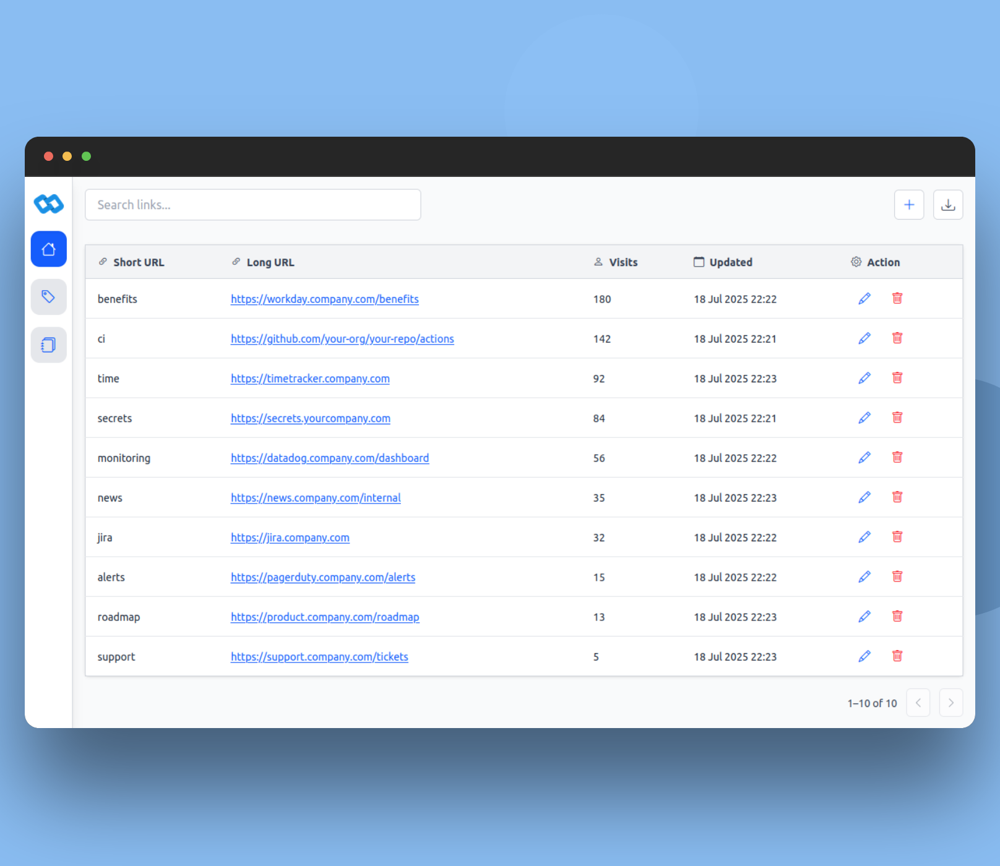
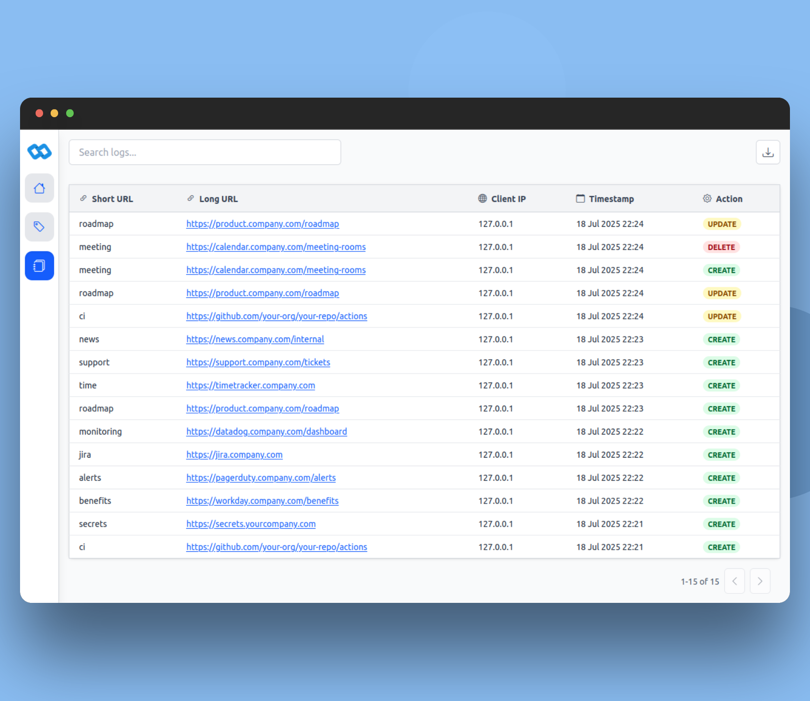

  

Go Links is a lightweight, self hosted application for creating easy to remember vanity URLs. Great for internal tools, sites or personal projects.
Instead of sharing or having to rember long, complex URLs, you can create short vanity URLs such as `go/standup` or `go/jira`.

- ⚡ Fast and lightweight 
- 📝 Built in audit trail. Every change is recorded for traceability
- 🔒 Fully self hosted. You maintain complete control over your data and links
- 🔋 Batteries included. No 3rd party network calls for JS, Fonts or CSS

| Links                                  | Logs                                   |
| -------------------------------------- | -------------------------------------- |
|   |    |

## Roadmap

Additional planned features include:

- 🏷️ Tagging system
- 📤 Ability to export your data 
- 🔐 Authentication / Permissions
