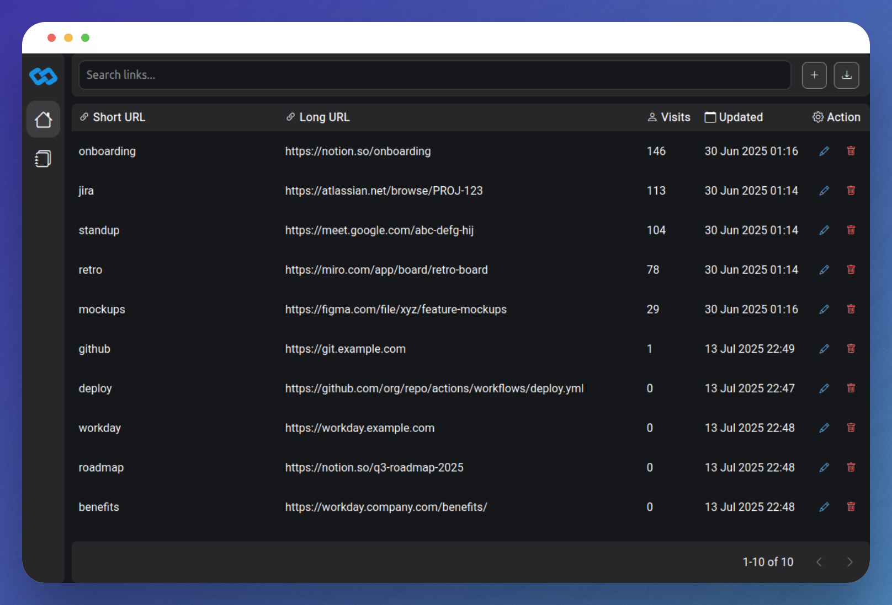

  

Go Links is a lightweight, self-hosted application for creating easy-to-remember vanity URLs. Great for internal tools, sites or personal projects.
Instead of sharing or having to rember long, complex URLs, you can create short aliases such as `go/standup` or `go/jira`.

- 🌐 Easy-to-use vanity URLs
- 📤 Ability to export your data 
- ⚡ Fast and lightweight with minimal dependencies
- 📝 Built-in audit trail — every change is recorded for traceability
- 🔒 Fully self-hosted — you maintain complete control over your data and links

## Motivation

Go Links is not a new concept. It's been used within tech companies for years to simplify internal URL sharing. However, there doesn’t seem to be a great open-source version available. Most options are either poorly maintained or locked behind a paywall.

But why should something as simple as a URL redirect require a subscription?I originally built this for myself, but I figured others might find it useful too. So... here we are. Open and free.

## Roadmap

This project is still in early development. Planned features include:

- 🏷️ Tagging system
- 🔐 Authentication / Permissions